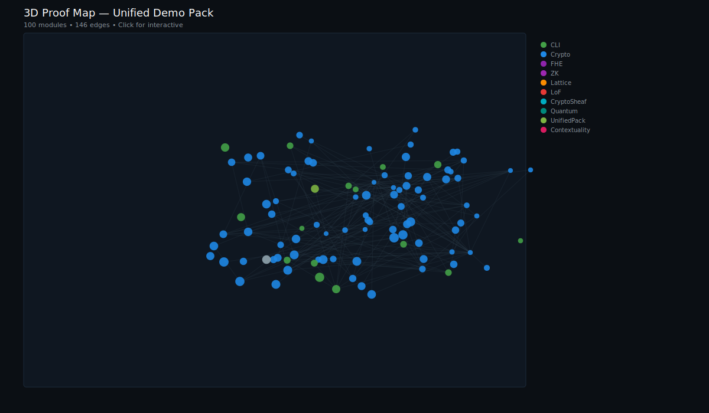
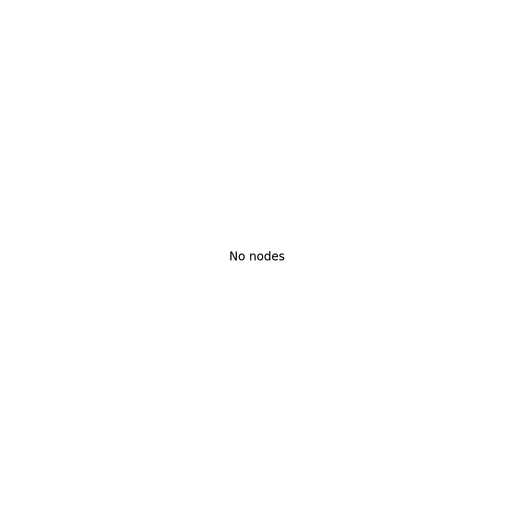

# Unified Demo Pack

## Bridging Quantum Foundations and Post-Quantum Security

This repository represents a novel approach to formal verification: unifying **quantum contextuality theory** with **post-quantum cryptographic primitives** in a single, machine-checked framework. Rather than treating these as separate domains, we demonstrate that the mathematical structures underlying quantum non-classicality and lattice-based cryptography share deep connections through **Heyting algebras** and **sheaf-theoretic methods**.

### Why This Matters

**The Quantum-Classical Boundary**: Quantum contextuality—the impossibility of assigning pre-existing values to quantum observables consistently across all measurement contexts—is one of the sharpest demarcations between quantum and classical physics. The Kochen-Specker theorem and Bell inequalities are famous examples. But contextuality isn't just physics; it's a **logical structure** that can be formalized and machine-verified.

**Post-Quantum Cryptography**: As quantum computers threaten RSA and elliptic curve cryptography, lattice-based schemes (MLWE, SIS, Ring-LWE) offer the most promising alternatives. These rely on the hardness of problems in high-dimensional lattices—mathematical structures that, surprisingly, connect to the same algebraic frameworks used in quantum foundations.

**The Bridge**: This project demonstrates that:
- Contextuality witnesses can be formalized as **obstructions to global sections** in a sheaf-theoretic setting
- The same Heyting algebra structures that capture intuitionistic logic also describe **homomorphic encryption** semantics
- Zero-knowledge proofs over lattice problems share structural properties with quantum non-locality arguments

By proving these connections in Lean 4 with Mathlib, we don't just claim they exist—we provide **machine-checkable evidence**.

---

## What's Inside

### 1. Contextuality Witnesses

We provide two complementary contextuality witnesses, each formally verified:

#### Triangle Model (Possibilistic)

A three-context measurement scenario proving that no global assignment of outcomes exists:

```
Contexts: C_ab, C_bc, C_ac (three overlapping measurement settings)
Supports:
  - AB: outcomes where a = b
  - BC: outcomes where b = c
  - AC: outcomes where a ≠ c

Theorem: triangle_no_global — no global section exists
```

Each support has exactly 2 elements (proved via explicit bijections), and the incompatibility of AC with AB∩BC demonstrates contextuality.

#### Mermin-Peres Magic Square (Quantum-Realizable)

The Mermin-Peres magic square is a 3x3 grid of two-qubit observables where:
- Each row product = +I (identity)
- Each column product = +I... except column 3 = -I

```lean
theorem no_assignment : ¬∃ (f : Fin 3 → Fin 3 → Int),
  (∀ i j, f i j = 1 ∨ f i j = -1) ∧
  (∀ i, f i 0 * f i 1 * f i 2 = 1) ∧
  (∀ j, f 0 j * f 1 j * f 2 j = if j = 2 then -1 else 1)
```

This is grounded in actual quantum mechanics via explicit Pauli matrix constructions in `HeytingLean.Quantum.Contextuality.MerminPeresRealization`, proving the operator identities that make this a physically realizable witness.

### 2. Valuation Framework (Finite Cardinalities)

We avoid unmeasurable claims about entropy or probability and instead work with **finite support cardinalities**—concrete, computable invariants:

| Context | Support Size | Proof |
|---------|--------------|-------|
| AB | 2 | `supportAB_card` |
| BC | 2 | `supportBC_card` |
| AC | 2 | `ContextualityAC.lean` |

### 3. Physical Process Layer (Quantum States & Channels)

The contextuality witnesses are grounded in a rigorous physical process formalization:

```lean
-- Density operators (positive semidefinite, trace 1)
structure Density (n : ℕ) where
  mat : Mat n
  psd : PosSemidef mat
  tr_one : Matrix.trace mat = 1

-- Quantum channels via Kraus representation
structure KrausChannel (n m : ℕ) where
  ops : List (Matrix (Fin n) (Fin m) ℂ)
  complete : ∑ K in ops, Kᴴ * K = 1
```

Key verified properties:
- `trace_map`: Channels preserve trace
- `isHermitian_map`: Channels preserve Hermiticity
- `posSemidef_map`: Channels preserve positive semidefiniteness

This provides the mathematical foundation for treating contextuality as a property of *physical processes*, not just abstract combinatorics.

### 4. FHE Hook (Homomorphic Encryption)

A spec-level formalization of noise-aware homomorphic addition over MLWE-shaped ciphertexts:

```lean
theorem homAdd_correct :
  EncRel P β₁ ct₁ m₁ → EncRel P β₂ ct₂ m₂ →
  EncRel P (β₁ + β₂) (addCt ct₁ ct₂) (m₁ + m₂)
```

This captures the essential correctness property: homomorphic operations preserve the message while noise accumulates predictably.

### 5. ZK Hook (SIS Proof of Knowledge)

A boolean verifier for Short Integer Solution (SIS) proofs of knowledge:

```lean
theorem sisVerify_sound : sisVerify params x w = true → SISInstance params x
```

This provides the type-level guarantee that passing verification implies a valid SIS witness exists.

---

## Proof Cartography

**100 project modules** · **146 import edges** · Color-coded by module family

### 3D Proof Map (Interactive)

<a href="https://abraxas1010.github.io/unified-demo-pack/unified_3d.html">

</a>

*Click the image above to open the interactive WebGL viewer. Drag to rotate, wheel to zoom, shift+drag to pan, hover for module details.*

### 2D Proof Map



*Crypto modules (FHE, ZK, Plonk) cluster separately from quantum contextuality modules.*

---

## Quick Start

```bash
# Clone and build
git clone https://github.com/Abraxas1010/unified-demo-pack.git
cd unified-demo-pack
make bootstrap   # installs elan if needed; fetches mathlib; builds

# Run verification
make run-quick   # Lean-only: contextuality + valuation + FHE/ZK hooks
```

### Output (JSON Contract)

```json
{
  "demo": "unified",
  "contextuality": {
    "contextual": true,
    "cover_size": 3,
    "witnesses": {
      "triangle": { "no_global": true, "kind": "possibilistic" },
      "mermin_peres": { "no_assignment": true, "quantum_realizable": true }
    },
    "checks": true
  },
  "physical": {
    "qstate": true,
    "qchannel": true,
    "checks": true
  },
  "valuation": {
    "supports": [
      { "context": "ab", "size": 2 },
      { "context": "bc", "size": 2 },
      { "context": "ac", "size": 2 }
    ]
  },
  "fhe": { "hom_add_demo": true },
  "zk": { "sis_pok_demo": true },
  "pqc": { "verified": false }
}
```

### Full Mode (with PQC Corpora Verification)

```bash
make run-full    # runs ACVP/KAT verification, sets sentinel, includes evidence hash
```

In full mode, `pqc.verified` becomes `true` and includes a hardened evidence hash (SHA256 over verification scripts and stdout).

---

## Project Structure

```
unified-demo-pack/
├── lean/
│   ├── HeytingLean/
│   │   ├── LoF/CryptoSheaf/Quantum/  # Contextuality formalization
│   │   │   └── MerminPeres.lean      # Magic square combinatorics
│   │   ├── Quantum/
│   │   │   ├── QState.lean           # Density operators
│   │   │   ├── QChannel.lean         # Kraus channels
│   │   │   └── Contextuality/        # Quantum realizations
│   │   │       └── MerminPeresRealization.lean
│   │   ├── Crypto/FHE/               # Homomorphic encryption specs
│   │   ├── Crypto/ZK/                # Zero-knowledge hooks
│   │   │   └── SigmaProtocolSpec.lean # Sigma protocol interface
│   │   └── CLI/UnifiedDemo.lean      # Unified JSON output
│   └── UnifiedPack/
│       └── ContextualityAC.lean      # AC cardinality proof
├── docs/
│   ├── umap2d.png                    # 2D proof map
│   ├── umap3d.png                    # 3D proof map (static)
│   ├── umap3d.html                   # 3D interactive (view locally)
│   └── module_graph.json             # Raw graph data
├── scripts/
│   ├── generate_umap.py              # Visualization generator
│   ├── generate_module_graph.py      # Dependency extraction
│   └── guard_no_sorry.sh             # No unproven claims
├── schema/                           # JSON schema definitions
└── Makefile                          # Build orchestration
```

---

## Verification Guarantees

| Guarantee | Mechanism |
|-----------|-----------|
| No `sorry`/`admit` | `guard_no_sorry.sh` blocks commits |
| Strict compilation | `lake build --wfail` |
| Toolchain pinning | `lean-toolchain` file |
| Mathlib version | Pinned in `lakefile.lean` (v4.24.0) |
| PQC evidence | Hardened sentinel with script+stdout hashes |

### Hardened Sentinel (Full Mode)

The PQC verification sentinel contains:
- `ts`: ISO timestamp
- `commit`: Repository hash
- `stdout_sha256`: Hash of verifier output
- `scripts_sha256`: Hash of verification scripts
- `evidence_hash`: Combined hash for auditability

---

## The Bigger Picture

This project is part of a larger research program exploring the **HeytingLean** framework—using Heyting algebras and topos-theoretic methods to unify:

- **Quantum foundations** (contextuality, non-locality, measurement)
- **Cryptographic primitives** (FHE, ZK, lattice problems)
- **Intuitionistic logic** (constructive proofs, type theory)
- **Category theory** (sheaves, sites, nuclei)

The key insight is that **contextuality is not just a quantum phenomenon**—it's a structural feature that appears whenever local consistency doesn't imply global consistency. This same pattern appears in:

- Distributed systems (eventual consistency vs. strong consistency)
- Cryptographic protocols (local simulation vs. global soundness)
- Database theory (view update problem)
- Modal logic (Kripke semantics with non-trivial accessibility)

By formalizing these connections in a proof assistant, we create **reusable infrastructure** for verified reasoning across domains.

---

## Contributing

This is research-grade code. Issues and PRs welcome, especially for:
- Additional contextuality scenarios (KCBS, GHZ, other graph states)
- Stronger FHE/ZK instantiations (multiplication proofs, concrete Sigma protocols)
- POVM joint measurability formalization
- Performance improvements to visualization pipeline
- Documentation and exposition

---

## License

MIT

---

## Acknowledgments

Built with [Lean 4](https://lean-lang.org/) and [Mathlib4](https://github.com/leanprover-community/mathlib4). Visualization powered by [UMAP](https://umap-learn.readthedocs.io/) and [Plotly](https://plotly.com/).
